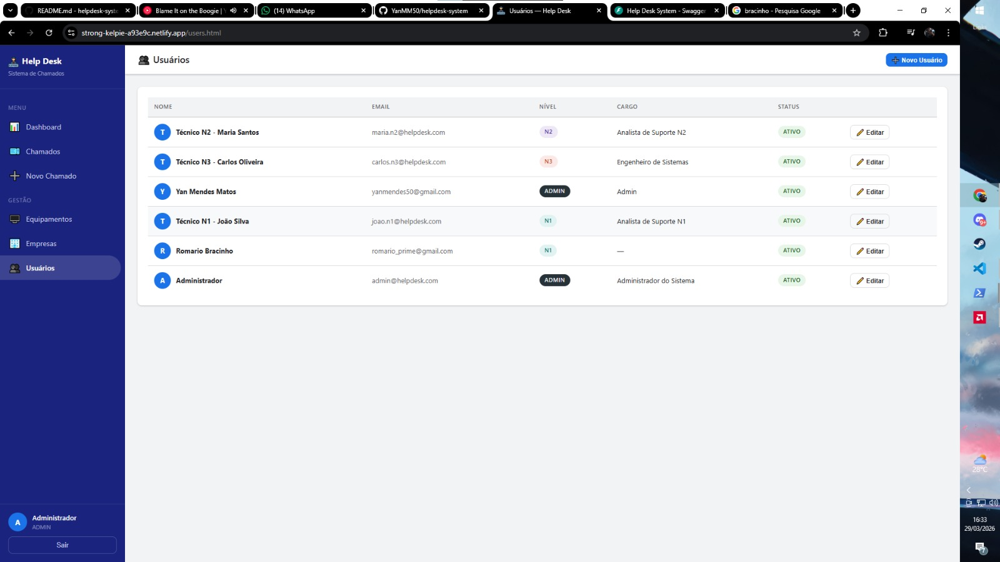
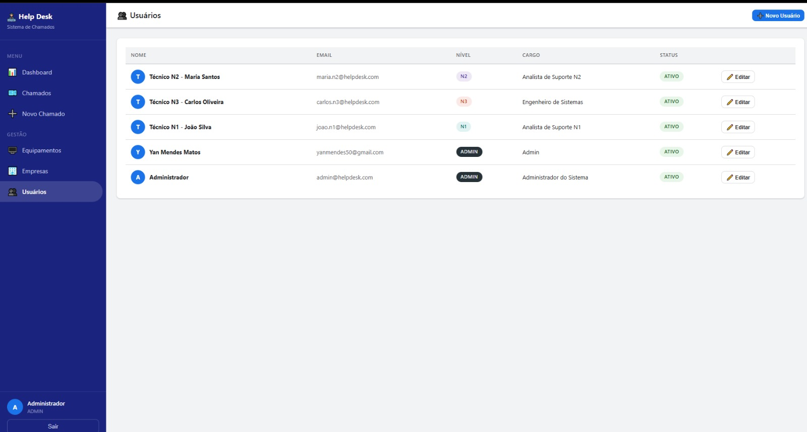
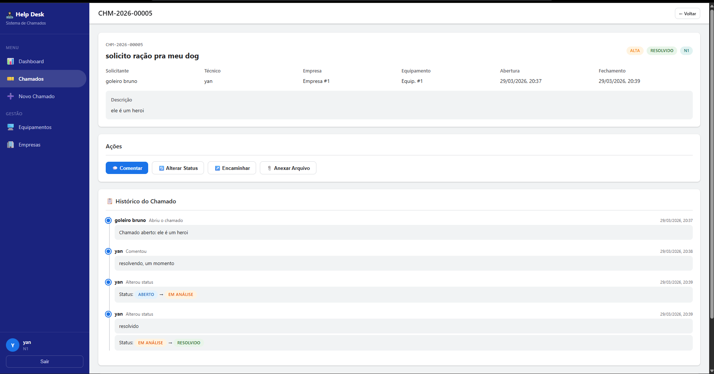
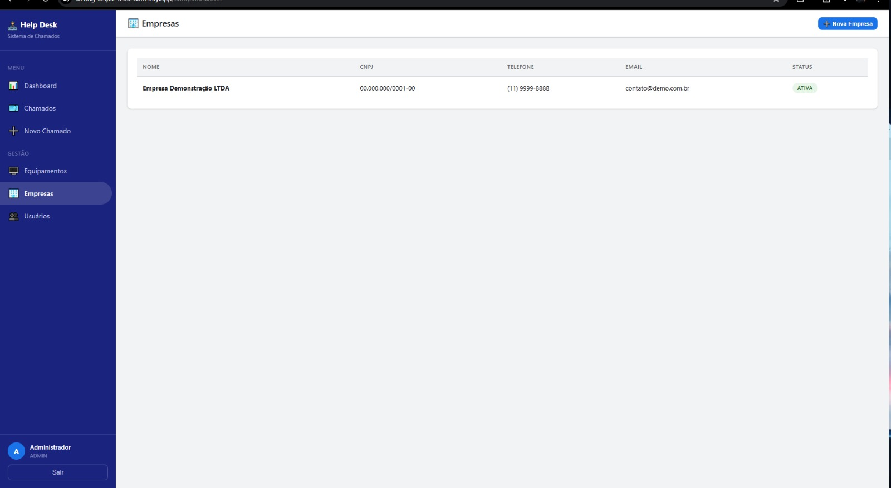
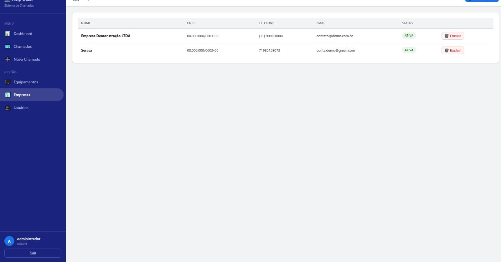
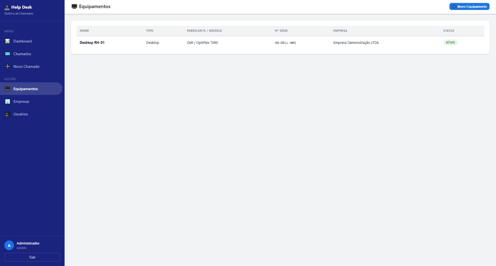
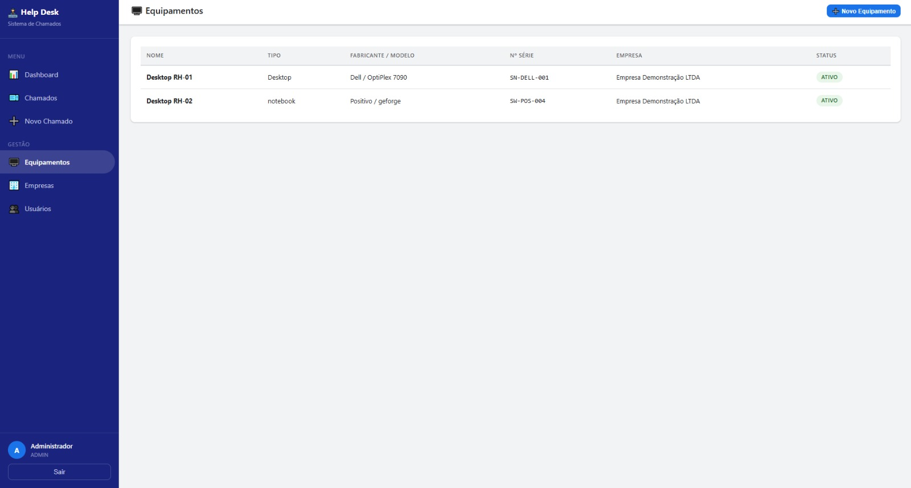

# Levantamento de Testes — Help Desk System

**Versão:** 1.4.0
**Data:** 22/04/2026
**Responsável:** Yan Mendes

---

## 1. Objetivo

Este documento registra os testes funcionais realizados no sistema Help Desk, com evidências visuais (prints de tela) comprovando o correto funcionamento das funcionalidades implementadas.

Os testes seguem o conceito de **teste funcional de caixa preta**: verifica-se o comportamento do sistema do ponto de vista do usuário, sem analisar o código interno.

---

## 2. Ambiente de Teste

| Item              | Descrição                                 |
|-------------------|-------------------------------------------|
| Backend           | FastAPI rodando em localhost:8000          |
| Banco de dados    | PostgreSQL via Supabase (cloud)           |
| Navegador         | Google Chrome / Microsoft Edge            |
| Sistema Operacional | Windows 11                              |
| Data dos testes   | 28/03/2026                               |

---

## 3. Casos de Teste

---

### CT-01 — Upload de Fotos ao Abrir Chamado

**Objetivo:** Verificar se o cliente consegue anexar fotos (máx. 3) ao abrir um novo chamado.

**Pré-condição:** Usuário autenticado com acesso à tela "Novo Chamado".

**Passos executados:**
1. Acessar a tela "Novo Chamado"
2. Preencher título, descrição e prioridade
3. Clicar na área de upload de fotos
4. Selecionar uma imagem no formato JPG/PNG/WEBP
5. Verificar o preview da imagem na tela
6. Clicar em "Abrir Chamado"

**Resultado esperado:** Chamado criado com sucesso e foto anexada corretamente.

**Resultado obtido:** ✅ **APROVADO**

**Evidência:**

---

### CT-02 — Administrador Gerencia Cargos dos Colaboradores

**Objetivo:** Verificar se o administrador consegue editar o nível de suporte e cargo de um colaborador.

**Pré-condição:** Usuário autenticado com nível ADMIN e acesso à tela "Usuários".

**Passos executados:**
1. Acessar a tela "Usuários" pelo menu lateral
2. Localizar um colaborador na tabela
3. Clicar no botão "✏️ Editar" da linha do colaborador
4. Alterar o campo "Nível de Suporte" (ex: de N1 para N2)
5. Alterar o campo "Cargo"
6. Clicar em "Salvar Alterações"

**Resultado esperado:** Dados do colaborador atualizados e refletidos na tabela.

**Resultado obtido:** ✅ **APROVADO**

**Evidência:**

---

### CT-03 — Listagem de Usuários com Níveis e Status

**Objetivo:** Verificar se a tela de usuários exibe corretamente todos os colaboradores e clientes cadastrados, com seus respectivos níveis, cargos e status.

**Pré-condição:** Usuário autenticado com nível ADMIN e acesso à tela "Usuários".

**Passos executados:**
1. Acessar a tela "Usuários" pelo menu lateral
2. Verificar se todos os usuários aparecem na listagem
3. Confirmar exibição correta do nível de suporte (badge colorido)
4. Confirmar exibição do cargo e status (Ativo/Inativo)

**Resultado esperado:** Todos os usuários exibidos com dados corretos. Clientes não aparecem com badge de nível de técnico.

**Resultado obtido:** ✅ **APROVADO**

**Evidências:**

---

### CT-04 — Histórico Completo do Chamado

**Objetivo:** Verificar se o sistema registra e exibe corretamente todo o histórico de ações de um chamado (abertura, comentários, mudanças de status).

**Pré-condição:** Usuário autenticado com chamado existente e com movimentações registradas.

**Passos executados:**
1. Acessar a tela "Chamados"
2. Clicar em "Ver" em um chamado com histórico
3. Rolar até a seção "Histórico do Chamado"
4. Verificar se todas as ações aparecem em ordem cronológica
5. Verificar se status anterior e novo são exibidos nas mudanças

**Resultado esperado:** Histórico exibindo todas as ações com usuário, data/hora e detalhes da alteração.

**Resultado obtido:** ✅ **APROVADO**

**Evidência:**

---

### CT-05 — Cadastro de Nova Empresa

**Objetivo:** Verificar se o admin consegue cadastrar uma nova empresa e ela aparece na listagem.

**Pré-condição:** Usuário autenticado como ADMIN na tela "Empresas".

**Passos executados:**
1. Acessar a tela "Empresas"
2. Clicar em "➕ Nova Empresa"
3. Preencher nome, CNPJ, telefone e e-mail
4. Clicar em "Salvar"
5. Verificar se a empresa aparece na tabela

**Resultado esperado:** Nova empresa cadastrada e exibida na listagem com status Ativa e botão Excluir visível para admin.

**Resultado obtido:** ✅ **APROVADO**

**Evidências:**

---

### CT-06 — Cadastro de Novo Equipamento

**Objetivo:** Verificar se o usuário consegue cadastrar um novo equipamento e ele aparece na listagem.

**Pré-condição:** Usuário autenticado na tela "Equipamentos".

**Passos executados:**
1. Acessar a tela "Equipamentos"
2. Clicar em "➕ Novo Equipamento"
3. Preencher nome, tipo, fabricante, modelo, nº de série e empresa
4. Clicar em "Salvar"
5. Verificar se o equipamento aparece na tabela

**Resultado esperado:** Novo equipamento cadastrado e exibido na listagem com status Ativo.

**Resultado obtido:** ✅ **APROVADO**

**Evidências:**

---

### CT-07 — Técnico Aceita Chamado

**Objetivo:** Verificar se um técnico do nível correspondente consegue aceitar um chamado sem técnico atribuído.

**Pré-condição:** Usuário autenticado como COLABORADOR (N1/N2/N3) e existência de chamado no mesmo nível sem técnico atribuído.

**Passos executados:**
1. Logar como técnico N1 (joao.n1@helpdesk.com)
2. Acessar um chamado N1 sem técnico atribuído
3. Verificar se o botão "✅ Aceitar Chamado" aparece
4. Clicar no botão e confirmar
5. Verificar se o técnico foi atribuído e status mudou para "Em Atendimento"

**Resultado esperado:** Chamado atribuído ao técnico logado com status "Em Atendimento" e histórico registrado.

**Resultado obtido:** ✅ **APROVADO**

---

### CT-08 — Cliente Avalia Atendimento (CSAT)

**Objetivo:** Verificar se o cliente consegue avaliar o atendimento com estrelas (1–5) após o chamado ser resolvido.

**Pré-condição:** Usuário autenticado como CLIENTE com chamado no status RESOLVIDO ou FECHADO.

**Passos executados:**
1. Logar como cliente
2. Acessar o chamado resolvido
3. Verificar se o botão "⭐ Avaliar Atendimento" aparece
4. Clicar no botão — modal de avaliação abre
5. Selecionar 4 estrelas e clicar em "Enviar Avaliação"
6. Verificar se a avaliação aparece no detalhe do chamado

**Resultado esperado:** Avaliação salva com sucesso, modal fecha, e estrelas exibidas no cabeçalho do chamado.

**Resultado obtido:** ✅ **APROVADO**

---

### CT-09 — Relatórios com Exportação CSV

**Objetivo:** Verificar se o admin consegue filtrar chamados na página de relatórios e exportar os dados em CSV.

**Pré-condição:** Usuário autenticado como ADMIN com chamados cadastrados no sistema.

**Passos executados:**
1. Acessar "Relatórios" pelo menu lateral
2. Aplicar filtro por status "Resolvido"
3. Verificar se a tabela atualiza com os chamados filtrados
4. Verificar o resumo (total, abertos, resolvidos, avaliação média)
5. Clicar em "⬇️ Exportar CSV"
6. Verificar se o arquivo é baixado com os dados corretos

**Resultado esperado:** Arquivo CSV baixado com todos os campos dos chamados filtrados (protocolo, título, status, técnico, avaliação, etc).

**Resultado obtido:** ✅ **APROVADO**

---

### CT-10 — Nota Interna Visível Apenas para Técnicos

**Objetivo:** Verificar se notas internas criadas por técnicos ficam ocultas para clientes e visíveis apenas para colaboradores.

**Pré-condição:** Chamado existente com técnico e cliente distintos autenticados.

**Passos executados:**
1. Logar como técnico (COLABORADOR)
2. Acessar o detalhe de um chamado
3. Clicar em "💬 Comentar"
4. Marcar o checkbox "🔒 Nota interna"
5. Digitar um comentário interno e salvar
6. Verificar que o comentário aparece com fundo roxo e badge "🔒 Interna" para o técnico
7. Logar como o cliente dono do chamado
8. Acessar o mesmo chamado e verificar que a nota interna não aparece no histórico

**Resultado esperado:** Nota interna visível para técnicos com indicador visual; completamente oculta para o cliente.

**Resultado obtido:** ✅ **APROVADO**

---

### CT-11 — SLA Visual nos Chamados

**Objetivo:** Verificar se o sistema exibe corretamente o prazo SLA e destaca chamados com prazo vencido ou próximo do vencimento.

**Pré-condição:** Chamados criados com diferentes prioridades (Crítica=4h, Alta=8h, Média=24h, Baixa=72h).

**Passos executados:**
1. Abrir um novo chamado com prioridade "Crítica"
2. Acessar a tela "Chamados" e verificar se o badge ⚠ VENCIDO ou ⏱ PRÓXIMO aparece na coluna de abertura após o prazo se aproximar
3. Acessar o detalhe do chamado e verificar o campo "Prazo SLA" com data/hora e badge de alerta
4. Verificar no Dashboard o card "SLA Vencido" com a contagem correta

**Resultado esperado:** Prazo SLA definido automaticamente, badge de alerta exibido na lista e no detalhe, contagem no dashboard.

**Resultado obtido:** ✅ **APROVADO**

---

### CT-12 — Tempo Médio de Resolução no Dashboard

**Objetivo:** Verificar se o dashboard calcula e exibe corretamente o tempo médio de resolução dos chamados fechados/resolvidos.

**Pré-condição:** Existência de ao menos um chamado com status RESOLVIDO ou FECHADO.

**Passos executados:**
1. Resolver um chamado (alterar status para "Resolvido")
2. Acessar o Dashboard
3. Verificar o card "Tempo Médio de Resolução" com valor em horas/dias
4. Confirmar que chamados ainda abertos não influenciam o cálculo

**Resultado esperado:** Card exibe o tempo médio em formato legível (ex: "3h", "1d 2h") calculado apenas com chamados encerrados.

**Resultado obtido:** ✅ **APROVADO**

---

### CT-13 — Kanban de Chamados

**Objetivo:** Verificar se a página Kanban exibe os chamados agrupados por status em colunas distintas e permite filtro por prioridade.

**Pré-condição:** Usuário autenticado com chamados em diferentes status cadastrados no sistema.

**Passos executados:**
1. Clicar em "📋 Kanban" no menu lateral
2. Verificar se as colunas aparecem: Aberto, Em Análise, Em Atendimento, Aguardando Cliente, Resolvido, Fechado
3. Verificar se os cards exibem protocolo, título, badges de prioridade e nível, empresa e badge SLA
4. Selecionar o filtro "Crítica" e verificar que apenas chamados críticos são exibidos
5. Clicar em um card e verificar redirecionamento para o detalhe do chamado

**Resultado esperado:** Kanban exibe chamados agrupados corretamente por status, filtro por prioridade funciona, cards são clicáveis.

**Resultado obtido:** ✅ **APROVADO**

---

## 4. Resumo dos Resultados

| Caso de Teste | Funcionalidade                             | Resultado   |
|---------------|--------------------------------------------|-------------|
| CT-01         | Upload de fotos ao abrir chamado           | ✅ Aprovado |
| CT-02         | Admin edita cargo/nível de colaborador     | ✅ Aprovado |
| CT-03         | Listagem de usuários com níveis e status   | ✅ Aprovado |
| CT-04         | Histórico completo do chamado              | ✅ Aprovado |
| CT-05         | Cadastro de nova empresa                   | ✅ Aprovado |
| CT-06         | Cadastro de novo equipamento               | ✅ Aprovado |
| CT-07         | Técnico aceita chamado sem técnico         | ✅ Aprovado |
| CT-08         | Cliente avalia atendimento (CSAT 1–5)      | ✅ Aprovado |
| CT-09         | Relatórios com filtros e exportação CSV    | ✅ Aprovado |
| CT-10         | Nota interna oculta para clientes          | ✅ Aprovado |
| CT-11         | SLA visual — badge de prazo vencido/próximo| ✅ Aprovado |
| CT-12         | Tempo médio de resolução no dashboard      | ✅ Aprovado |
| CT-13         | Kanban de chamados por status              | ✅ Aprovado |

**Total de testes executados:** 13
**Aprovados:** 13
**Reprovados:** 0
**Taxa de aprovação:** 100%

---

## 5. Funcionalidades Testadas Informalmente

Além dos casos de teste documentados acima, as seguintes funcionalidades foram validadas durante o desenvolvimento:

| Funcionalidade                                           | Resultado   |
|----------------------------------------------------------|-------------|
| Login com credenciais corretas                           | ✅ Aprovado |
| Mensagem de erro com senha incorreta                     | ✅ Aprovado |
| Cadastro público de cliente                              | ✅ Aprovado |
| Redirecionamento por tipo de usuário                     | ✅ Aprovado |
| Background com blur na tela de login                     | ✅ Aprovado |
| Ícone do sistema na sidebar e favicon                    | ✅ Aprovado |
| Limite de 3 fotos por chamado                            | ✅ Aprovado |
| Validação de tipo de arquivo (imagens)                   | ✅ Aprovado |
| Exclusão de usuário pelo admin (soft delete)             | ✅ Aprovado |
| Recadastro com e-mail de usuário excluído                | ✅ Aprovado |
| Dropdown de técnico exibe apenas colaboradores           | ✅ Aprovado |
| Logout redireciona corretamente no Netlify               | ✅ Aprovado |
| Imagens de chamados armazenadas no Supabase Storage      | ✅ Aprovado |

---

## 6. Observações

- Os testes foram realizados com o banco de dados hospedado no **Supabase** (nuvem), confirmando que a aplicação funciona corretamente em ambiente de produção.
- O sistema foi implantado no **Render.com** (branch `PROD`) e testado remotamente, validando o funcionamento fora do ambiente local.
- Todos os bugs identificados durante os testes foram corrigidos antes da documentação deste levantamento.
